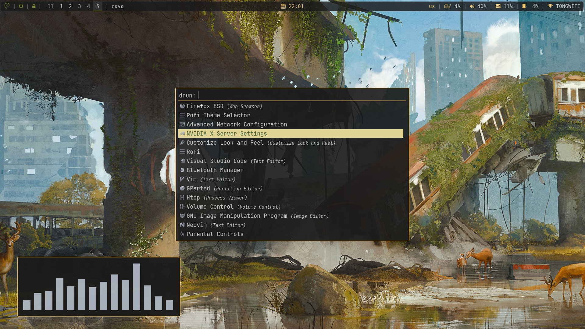
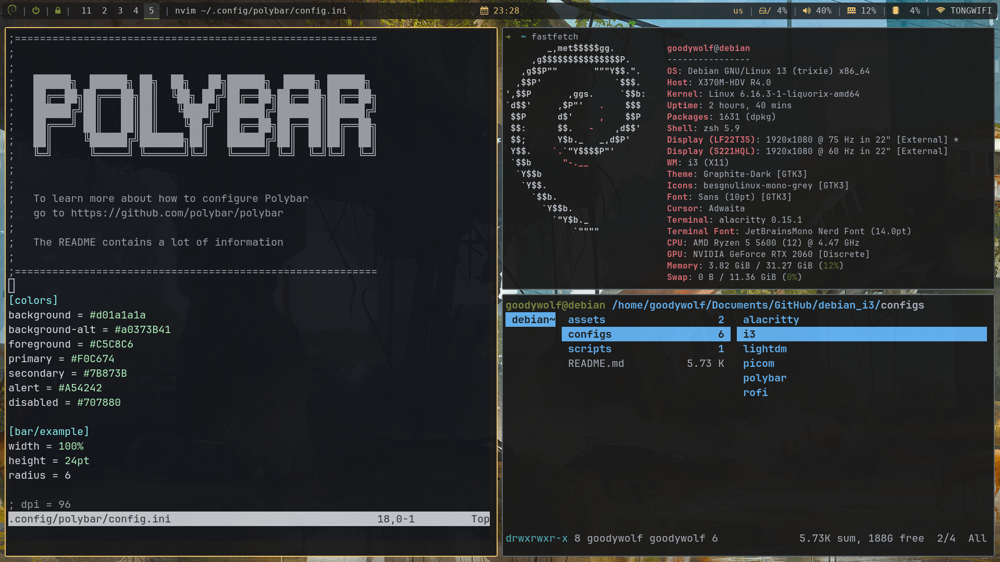
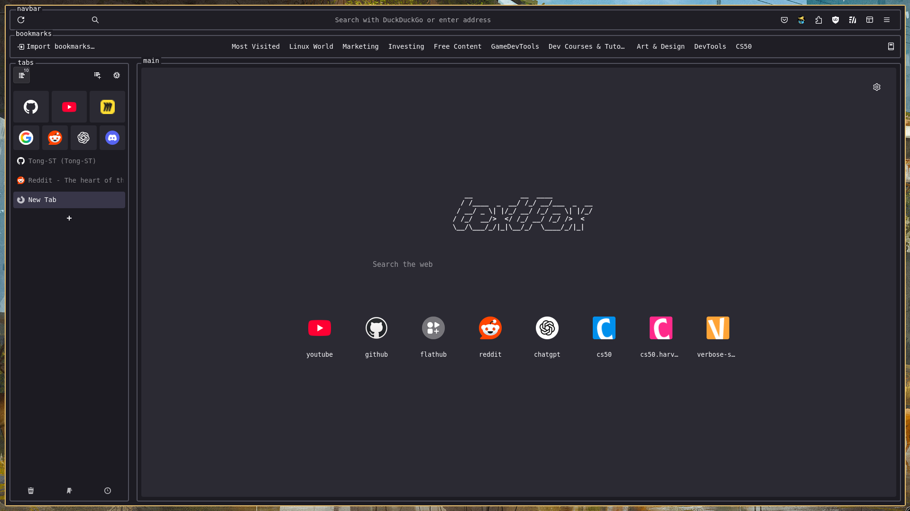

# The Debian 13 + i3wm + Nvidia Setup
> The Debian + i3 + Nvidia setup (That tailored for my personal PC Desktop) But you can follow step by step with curious, Recommend for people who have some experiences fixing problem

I might say it a Post Apocalyptic Theme! (Just Love the default Polybar yellow man..)



## Update Kernel Using Liquorix (OPTIONAL)

In this setup I will be install Liquorix as linux Kernel that give debian to newer kernel version this help me fixes a lot issue dealing with hardware support

**Liquorix** are **not required** here, You can go with shipped kernel of debian 13 and it work fine

- Install Liquorix on Debian
    1. install " curl " if not already and Installing
        ```
        sudo apt install curl -y
        curl 'https://liquorix.net/add-liquorix-repo.sh' | sudo bash 
        ```
    2. Verify " Liquorix " install completed

        ``` 
        sudo apt update
        sudo apt install linux-image-liquorix-amd64 linux-headers-liquorix-amd64
        ```

    3. Restart ` reboot ` and make sure ***SECURE BOOT*** (BIOS) is ***DISABLE*** in orders to start using ***liquorix***
    4. To verify ` uname -r ` to check kernel version if it say 6.x.xx-x-liquorix-amd64(or some like that) Now you on.

## Nvidia setup (OPTIONAL for nvidia users who want to games)
For Nvidia setup with debian 13, If you not gaming you can go with nouveau which is open source overall good performance and don't have to do anything it should come with kernel

But if you gaming Nvidia Proprietor Driver it still ahead on performance, Please go and read Debian wiki how to install Nvidia Proprietor [Debian Nvidia wiki](https://wiki.debian.org/NvidiaGraphicsDrivers#Version_550.163.01)
basically you've to added download source first before you can `sudo apt install nvidia-driver`

## Install Main Component
- Install Main i3 Setup (I do with Bare bone Debian with i3 No others DE)
    ```
    sudo apt install xorg i3-wm i3status i3lock
    ```
- Install Essential apps
    ```
    sudo apt install alacritty firefox-esr feh maim xclip wget curl git pipx \
    python3-pip timeshift thunar network-manager blueman pavucontrol \
    brightnessctl htop dunst mate-polkit mesa-vulkan-drivers mesa-utils \
    pipewire pipewire-audio wireplumber redshift
    ```
- Install and get flatpak ready for you fav apps 
    ```
    sudo apt install flatpak
    flatpak remote-add --if-not-exists flathub https://dl.flathub.org/repo/flathub.flatpakrepo
    ```

## Setup Config Files
### Install Main Configs files
- i3 Config file

    ```
    mkdir ~/.config/i3
    cd debian_i3
    cp -r configs/i3/* ~/.config/i3/
    ```
    - And go to .config file then change for your liking and understand it `sudo nano ~/.config/i3/config`
    - Some default keybinding i use
        - ` WIN+SHIFT+E ` = Logout from Sway
        - ` WIN+SHIFT+W ` = Close window/application
        - ` WIN+SHIFT+C ` = Reload sway config file to see chagnes (Error might show, better fix what's wrong before move on)
        - ` WIN+D ` = Search for app using rofi
        - ` WIN+ENTER ` = Open alacritty terminal
        - ` WIN+Z ` = Open your browser default with firefox
- Alacritty config file
    ```
    mkdir ~/.config/alacritty/
    cp -r configs/alacritty/* ~/.config/alacritty/
    ```
- Install Wallpapers

    ```
    sudo cp assets/wallpapers/*.jpg /usr/share/wallpapers/
    ```

## Install Assets & fonts (for those `cp` step make sure you `cd` in debian_i3 folder first)

- Install Basic Fonts
    ```
    sudo apt install fonts-dejavu fonts-noto fonts-noto-color-emoji fonts-font-awesome
    ```
- Install `FontAwesome 7` that use for **Polybar icons**

    ```
    sudo mkdir -p /usr/share/fonts/fontawesome-7/
    sudo cp assets/fontawesome-free-7.0.0-desktop/*.otf /usr/share/fonts/fontawesome-7/
    sudo fc-cache -f -v
    ```
- Install JetBrain Nerd Font for rofi theme

    ```
    wget -P ~/.local/share/fonts https://github.com/ryanoasis/nerd-fonts/releases/download/v3.0.2/JetBrainsMono.zip
    cd ~/.local/share/fonts
    unzip JetBrainsMono.zip
    rm JetBrainsMono.zip
    fc-cache -fv
    ```

### Additional configs

- Install `polybar` (MAIN) for main status bar

    ```
    sudo apt install polybar
    mkdir ~/.config/polybar
    cp -r configs/polybar/* ~/.config/polybar/
    ```
- Install `rofi` (MAIN) for app launcher also theming it

    ```
    sudo apt install rofi
    mkdir ~/.config/rofi
    cp configs/rofi/config.rasi ~/.config/rofi/
    sudo cp configs/rofi/DarkYellow.rasi /usr/share/rofi/themes/
    ```
    - You can also change theme by `Rofi Theme Selector` itself.
- Install `picom` (OPTIONAL) for composition fade, rounded-corner, transparency

    ```
    sudo apt install picom
    mkdir ~/.config/picom
    cp -r configs/picom/* ~/.config/picom/
    ```
- Install `Lightdm` (RECOMMEND if do not have any login manager yet) for login manager also custom script for monitor setup

    ```
    sudo apt install lightdm
    sudo cp -r configs/lightdm/* /etc/lightdm/
    ```
    (**OPTIONAL & UNSTABLE** for only people who know what is it doing, I will find the better way and update later) Below step ONLY for **Multi-monitor** setup add **custom script** to lightdm
    
    In `sudo nano /etc/lightdm/lightdm.conf` GO and **Uncomment** line below [Seat:*] `display-setup-script` then in debian_i3 folder copy *my script* file to /etc/script by command below
    ```
    mkdir /etc/script/
    sudo cp -r scripts/* /etc/script/
    sudo nano /etc/script/monitor_setup.sh
    ``` 
    Change name of the your current monitor that said like HDMI-0 / DVI-D-0
    To see your current monitor output name use command: `xrandr` here you can identify which monitor you have

    After finish setup use `sudo systemctl restart lightdm` and verify if it work

    **But if you got Black Screen**, just access tty by `CTRL` + `ALT` + `F3` then access the lightdm config `sudo nano /etc/lightdm/lightdm.conf` comment back for now, or Fix monitor_setup.sh `sudo nano /etc/script/monitor_setup.sh`

## AFTER INSTALL
- You might want to do is switch between language go here `sudo nano /etc/default/keyboard`
- Change wallpaper just in `sudo nano ~/.config/i3/config` line that exec `feh` go and change new path to your img
- Want Darkmode? The easy way would be ``` sudo apt install lxappearance ``` get some theme from gnome-look.org install on like ``` /usr/share/themes ```
- Eye-care you can add `exec_always --no-startup-id redshift -l LAT:LON` to i3 config, Adjust LAT:LON to your location to get it just go to google maps, right click on your location lat:long will appear first
- Personalize Firefox see [textfox](https://github.com/adriankarlen/textfox) for theming guide can also use configs from mine

## NOTED FOR ME
- Problem with my Device can't use `network-manager`, So I can connect using `iwconfig`
    - Activate wifi interface, `<device_name>` like: *wlp3s0* see in `ip link`
        ```
        sudo ip link set <device_name> up 
        ```
    - (OPTION 1) Connect to WEP network
        ```
        sudo iwconfig <device_name> essid "WLAN_NAME" key s:WLAN_PASSWORD
        ```
    - (OPTION 2) Connect to WPA/WPA2 network (most likely for me)
        ```
        sudo nano /etc/wpa_supplicant/wpa_supplicant.conf
        ```
        Add to that file
        ```
        network={
            ssid="wifi_name"
            psk="wifi_key"
        }
        ```
        Then connect using:
        ```
        sudo wpa_supplicant -B -i <device_name> -c /etc/wpa_supplicant/wpa_supplicant.conf
        ``` 


## References
- [Debian - i3 wiki](https://wiki.debian.org/i3)
- [Monochrome Icons set use on rofi](https://www.gnome-look.org/p/2151189)
- [Installing ZSH/Oh my zsh for Shell on debian guide](https://getcyber.me/posts/installing-and-using-zsh-instead-of-bash-on-debian-based-systems/)
- [Wallpapers use in this setup](https://wall.alphacoders.com/big.php?i=1313742)
- [Font Awesome to get more Icons! In setup I only install Free version, If go paid you may have to install for yourself](https://fontawesome.com)